# Geek Shop

Frontend for a geek products store. Customers can browse products by category, view
product details and manage a shopping cart. Store owners have a dedicated dashboard to manage their store and products.
Includes a complete authentication flow with login, password recovery, and email verification.
Fully responsive design for mobile and desktop.

## ⚡ Quick Start

1. Clone the repository
2. Follow the [Setup](#️-setup) section
3. Follow the [How to Run](#️-how-to-run) section

## 🚀 Tech Stack

- **Framework:** React 19 + TypeScript
- **Build Tool:** Vite
- **Styles:** TailwindCSS + Material UI
- **Routing:** React Router DOM
- **Data Fetching:** TanStack Query
- **Forms:** Formik + Yup / React Hook Form + Zod
- **HTTP Client:** Axios
- **Testing:** Playwright
- **Notifications:** React Toastify
- **State Management:** Zustand
- **Decimal Arithmetic:** Decimal.js

## ⚙️ Setup

### Prerequisites

- [Node >=24](https://github.com/nvm-sh/nvm)

### Installation

1. Run `npm ci` to install dependencies
2. Run `npm run dev:prepare` to generate environment variables
3. Run `npm run test:install` to install Playwright dependencies

## ▶️ How to Run

### Server

```bash
# Development
npm run start:dev

# Production (build first)
npm run build
npm run start:prod
```

### Testing

```bash
# Run all tests with coverage
npm run test

# Run tests with UI
npm run test:ui

# Generate coverage report
npm run test:coverage
```

### Code Quality

```bash
# Lint and fix
npm run lint

# Format code
npm run format
```

## 🌍 Environment Variables

The `dev:prepare` script generates the `.env` file automatically. Key variables:

| Variable       | Description     | Example                        |
| -------------- | --------------- | ------------------------------ |
| `PORT`         | Dev server port | `3000`                         |
| `VITE_API_URL` | Backend API URL | `http://localhost:3001/api/v1` |

> All environment variables exposed to the app must be prefixed with `VITE_`

## 📸 Screenshots

### Desktop

|                                                      |                                                                           |
| ---------------------------------------------------- | ------------------------------------------------------------------------- |
| 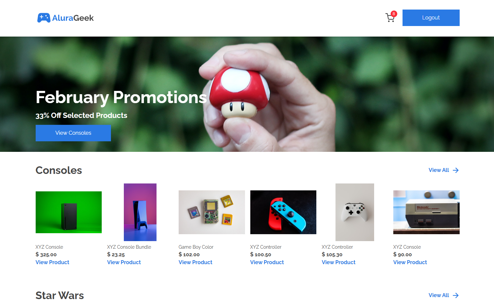                 | 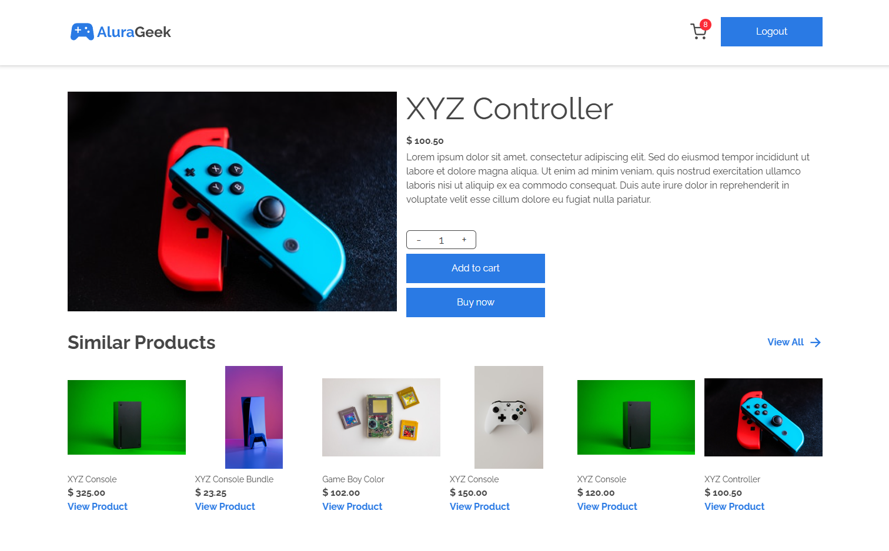                  |
| 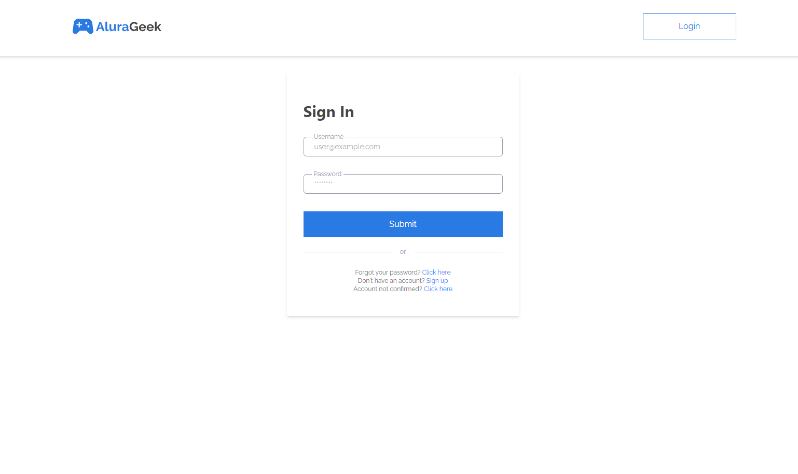               | 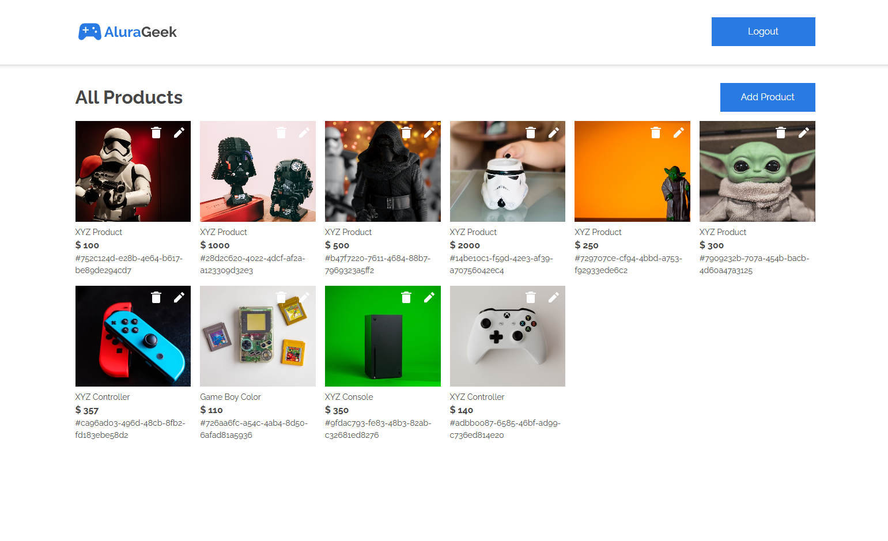                |
| 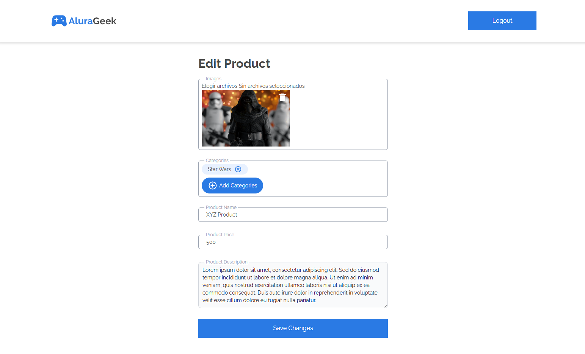 | 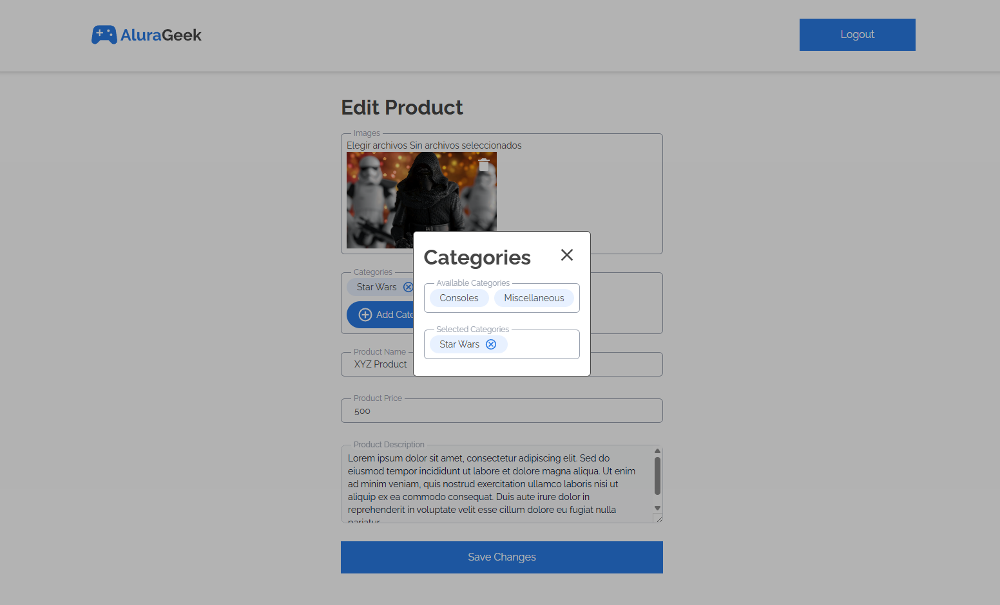 |
| 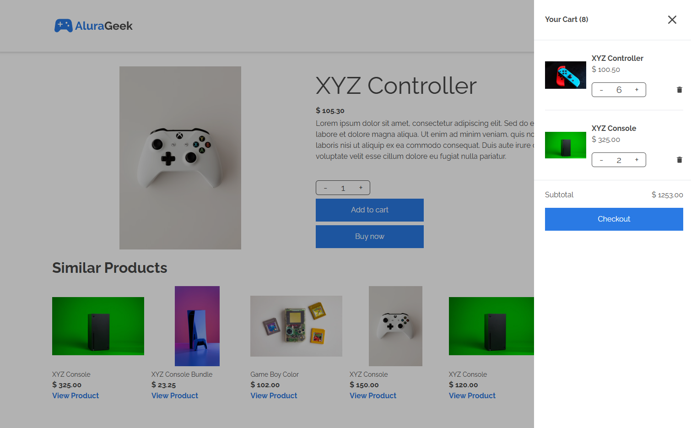   |

### Mobile

|                                                                  |                                                                          |
| ---------------------------------------------------------------- | ------------------------------------------------------------------------ |
| 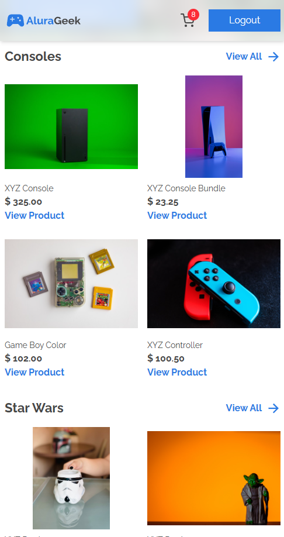               | 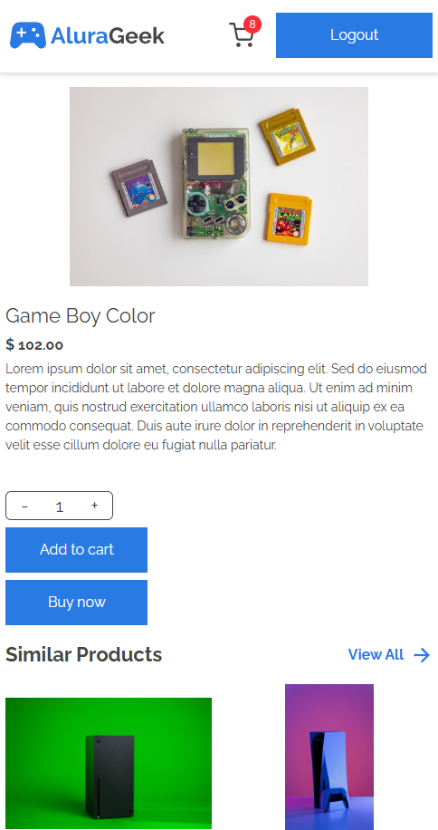   |
| 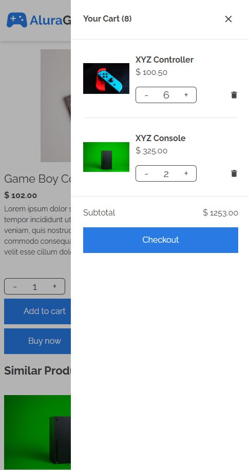 | 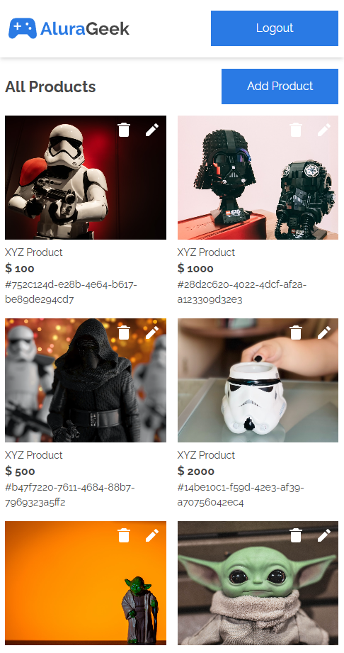 |

## 📁 Project Structure

```
src/
├── assets/         # Static assets
├── components/     # Shared components
├── configs/        # Configuration files
├── errors/         # Error handling
├── features/       # Feature modules
├── hooks/          # Global custom hooks
├── interfaces/     # Global TypeScript interfaces
├── layouts/        # Layout components
├── pages/          # Route pages (orchestrators)
├── services/       # Global API services
└── utils/          # Utility functions
```

### Feature Module Structure

Each feature follows this structure:

```
└── 📁example-feature
    ├── 📁components/     # Feature-specific components
    ├── 📁constants/      # Feature-specific constants
    ├── 📁hooks/          # Feature-specific hooks (optional)
    ├── 📁interfaces/     # Feature-specific interfaces
    ├── 📁mappers/        # Feature-specific mappers (optional)
    ├── 📁services/       # Feature-specific services
    └── 📁utils/          # Feature-specific utilities (optional)
```

## 🛠️ Recommended Tools

- [ESLint](https://marketplace.visualstudio.com/items?itemName=dbaeumer.vscode-eslint)
- [Prettier](https://marketplace.visualstudio.com/items?itemName=esbenp.prettier-vscode)
- [EditorConfig](https://marketplace.visualstudio.com/items?itemName=EditorConfig.EditorConfig)

## 👤 Author

| [<br><sub>Javier Anibal Villca</sub>](https://github.com/Javier104-dev) |
| :------------------------------------------------------------------------------------------------------------------------------------------------: |
